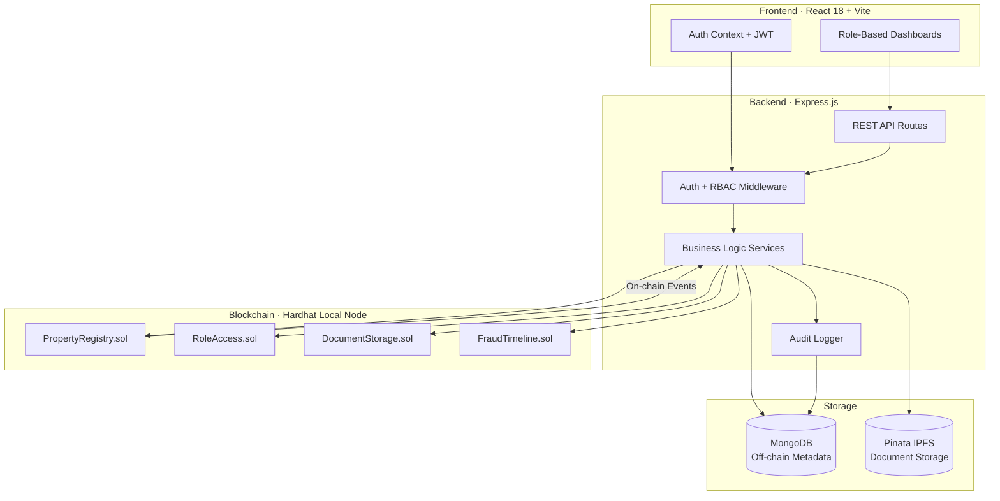
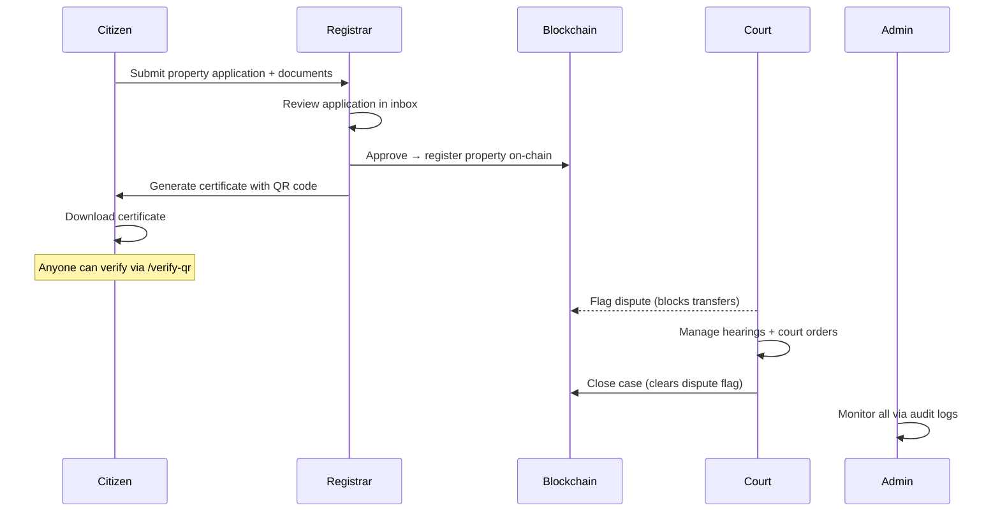

<div align="center">

# ⛓️ BlockEstate — Blockchain Land Registry System

**Tamper-proof property registration with smart contracts, RBAC, and QR verification**

[](https://github.com/coolss21/blockestate/actions)
[](https://soliditylang.org/)
[](https://nodejs.org/)
[](https://react.dev/)
[](https://mongodb.com/)
[](LICENSE)

</div>

---

## 📌 Overview

BlockEstate is a **production-grade, blockchain-based land registry system** that brings transparency and trust to property transactions. It features 4-role RBAC (Citizen, Registrar, Court, Admin), on-chain property registration via Solidity smart contracts, IPFS document storage, QR-based verification, and a complete dispute resolution workflow — all accessible through a password-based login (no MetaMask required).

---

## 🏗️ System Architecture



---

## ✨ Key Features

- **🔐 Password-Based Auth** — Email/password login (NO MetaMask required)
- **👥 4 User Roles** — Citizen, Registrar, Court, Admin with strict RBAC
- **⛓️ Blockchain Integration** — Local Hardhat Ethereum node (fully offline)
- **📂 IPFS Storage** — Pinata integration for tamper-proof document storage
- **🗄️ MongoDB** — Off-chain metadata, audit logs, and case management
- **📱 QR Verification** — Public property verification via scannable QR codes
- **⚖️ Dispute Resolution** — Complete court workflow with hearings and orders
- **📊 Audit Trail** — Every action logged for full transparency

---

## 🛠️ Tech Stack

| Layer | Technology |
|-------|-----------|
| **Blockchain** | Hardhat, Solidity ^0.8.20, Ethers.js v6 |
| **Backend** | Node.js, Express, MongoDB, Mongoose, JWT, bcrypt |
| **Frontend** | React 18, Vite, React Router v6, Axios, Tailwind CSS |
| **Storage** | MongoDB (off-chain), Pinata IPFS (documents) |
| **DevOps** | GitHub Actions CI/CD |

---

## 📂 Project Structure

```
blockestate/
├── blockchain/               # Hardhat + Solidity smart contracts
│   ├── contracts/            # PropertyRegistry, RoleAccess, DocumentStorage, FraudTimeline
│   └── scripts/              # Deploy + ABI export scripts
├── backend/                  # Express.js API server
│   ├── src/
│   │   ├── models/           # Mongoose schemas
│   │   ├── routes/           # REST API routes (auth, citizen, registrar, court, admin)
│   │   ├── services/         # Business logic layer
│   │   └── middleware/       # Auth + RBAC middleware
│   └── .env                  # Backend configuration
├── frontend/                 # React + Vite SPA
│   ├── src/
│   │   ├── pages/            # Role-based dashboard pages
│   │   ├── components/       # Reusable UI components
│   │   └── context/          # Auth context provider
│   └── .env                  # Frontend configuration
├── .github/workflows/        # CI/CD pipeline
├── CREDENTIALS.md            # User setup documentation
├── LICENSE                   # MIT License
└── README.md
```

---

## 🚀 Quick Start

### Prerequisites
- **Node.js** v18+
- **MongoDB** (Docker recommended)
- **Git**

### 1. Install Dependencies

```bash
# From project root
cd blockchain && npm install
cd ../backend && npm install
cd ../frontend && npm install
```

### 2. Start MongoDB

```bash
# Option A: Docker (Recommended)
docker run -d -p 27017:27017 --name mongodb mongo:latest

# Option B: Local MongoDB installation
# Download from https://www.mongodb.com/try/download/community
```

### 3. Configure Environment

Backend `.env` is pre-configured for local development. Key variables:

```env
PORT=5000
MONGO_URI=mongodb://localhost:27017/blockestate
JWT_SECRET=your-super-secret-jwt-key-change-in-production
RPC_URL=http://127.0.0.1:8545
CONTRACT_ADDRESS=(set after deployment)
PINATA_JWT=(optional — system works without it)
```

### 4. Start Blockchain Node

```bash
cd blockchain
npm run node
# Keep this terminal open — Hardhat node runs at http://127.0.0.1:8545
```

### 5. Deploy Smart Contracts (New Terminal)

```bash
cd blockchain
npm run deploy
npm run export
# Copy the PropertyRegistry address → paste into backend/.env CONTRACT_ADDRESS
```

### 6. Start Backend (New Terminal)

```bash
cd backend
npm run dev
# ✓ Connected to MongoDB
# ✓ Server running on http://localhost:5000
```

### 7. Start Frontend (New Terminal)

```bash
cd frontend
npm run dev
# ➜ Local: http://localhost:5173/
```

---

## 🔄 End-to-End Workflow



---

## 🔌 API Reference

<details>
<summary><strong>Authentication</strong></summary>

| Method | Endpoint | Description |
|--------|----------|-------------|
| `POST` | `/api/auth/register` | Register new user |
| `POST` | `/api/auth/login` | Login with email/password |
| `POST` | `/api/auth/logout` | Logout |
| `GET` | `/api/auth/me` | Get current user |

</details>

<details>
<summary><strong>Citizen</strong></summary>

| Method | Endpoint | Description |
|--------|----------|-------------|
| `GET` | `/api/citizen/dashboard` | Dashboard stats |
| `GET` | `/api/citizen/properties` | List user properties |
| `POST` | `/api/citizen/apply` | Submit application (with file upload) |
| `GET` | `/api/citizen/applications` | List applications |
| `GET` | `/api/citizen/disputes` | List disputes |

</details>

<details>
<summary><strong>Registrar</strong></summary>

| Method | Endpoint | Description |
|--------|----------|-------------|
| `GET` | `/api/registrar/dashboard` | Dashboard stats |
| `GET` | `/api/registrar/inbox` | Application inbox |
| `GET` | `/api/registrar/application/:appId` | Application details |
| `POST` | `/api/registrar/application/:appId/approve` | Approve (registers on blockchain) |
| `POST` | `/api/registrar/application/:appId/reject` | Reject application |
| `POST` | `/api/registrar/certificate/:propertyId` | Generate certificate with QR |

</details>

<details>
<summary><strong>Court</strong></summary>

| Method | Endpoint | Description |
|--------|----------|-------------|
| `GET` | `/api/court/dashboard` | Dashboard stats |
| `POST` | `/api/court/cases/register` | Register case (flags dispute on-chain) |
| `GET` | `/api/court/cases` | List cases |
| `POST` | `/api/court/cases/:caseId/orders` | Add court order |
| `GET` | `/api/court/hearings` | List hearings |
| `POST` | `/api/court/hearings` | Schedule hearing |
| `POST` | `/api/court/cases/:caseId/close` | Close case (clears on-chain flag) |

</details>

<details>
<summary><strong>Admin & Public</strong></summary>

| Method | Endpoint | Description |
|--------|----------|-------------|
| `GET` | `/api/admin/dashboard` | System statistics |
| `GET` | `/api/admin/users` | List users |
| `PATCH` | `/api/admin/users/:id/role` | Change user role |
| `GET` | `/api/admin/audit` | Audit logs |
| `GET` | `/api/public/property/:propertyId` | Public property info |
| `POST` | `/api/public/verify` | Verify property (via QR or ID) |

</details>

---

## 🔒 Security

- Password hashing with **bcrypt**
- JWT authentication with **httpOnly cookies**
- Strict **role-based access control** (RBAC)
- Blockchain **transaction verification**
- Document **hash verification** (tamper detection)
- Full **audit logging** for every action

---

## 🛑 Troubleshooting

| Problem | Solution |
|---------|----------|
| MongoDB connection error | Ensure MongoDB runs on port 27017 (`docker ps`) |
| Blockchain connection error | Ensure Hardhat node is running (`npm run node`) |
| Frontend can't connect | Verify backend on port 5000, check CORS in browser console |
| Contract deployment fails | Start Hardhat node first, then run `npx hardhat compile` |

---

## 📄 License

This project is licensed under the [MIT License](LICENSE).

<div align="center">
  <br/>
  <p><i>Built with ❤️ for secure, transparent land registry on the blockchain.</i></p>
</div>
